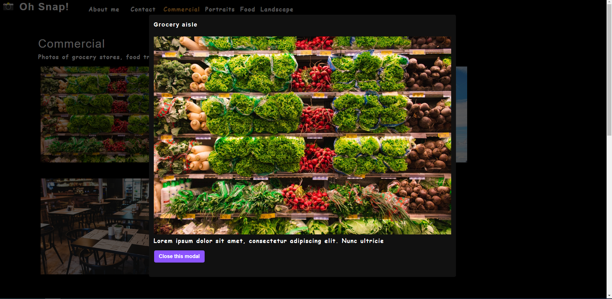

# photo-port

- Github URL: https://github.com/DanielCConlon/photo-port
- Heroku URL: https://danielcconlon.github.io/photo-port/

## Table-of-Contents

- [Description](#description)
- [Usage](#usage)
- [Application](#application)

## [Description](#description)

Photo-port is a single-page application photography portfolio built using React following the steps of a course module.

## [Usage](#table-of-contents)

Using React to make a photography portfolio you learn these skills:

- React allows the UI to be segmented into components.

- Components are functions that are reusable.

- Hooks are used to manage state.

- JSX is a shorthand approach to create elements.

- Conditional rendering of components can create single-page applications.

- Testing in React mimics user behavior.

## [Application](#table-of-contents)

